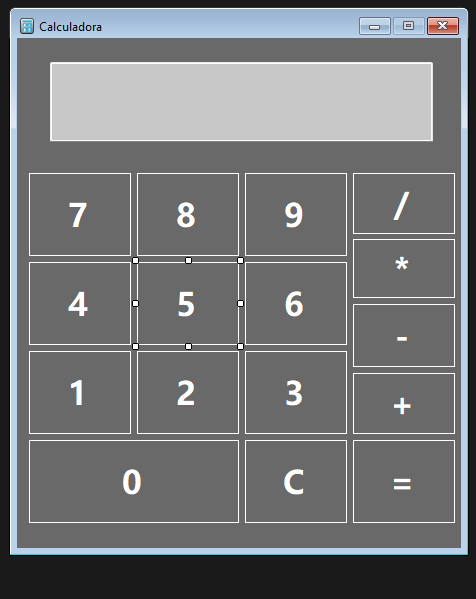

# 🧮 Calculadora Simples em C#

Este projeto é uma **calculadora básica** desenvolvida em **Windows Forms com C#** no Visual Studio.  
O objetivo foi praticar a criação de interfaces gráficas (GUI) e manipulação de eventos de botões no Windows Forms.

---

## 🚀 Funcionalidades

- Operações matemáticas básicas:
  - Adição (+)
  - Subtração (-)
  - Multiplicação (*)
  - Divisão (/)
- Botão **C** para limpar o visor.
- Botão **=** para exibir o resultado.
- Interface simples e intuitiva.

---

## 🖼️ Captura de Tela

---

## 🛠️ Tecnologias Utilizadas

- **C#**
- **.NET Framework**
- **Windows Forms**
- **Visual Studio**

